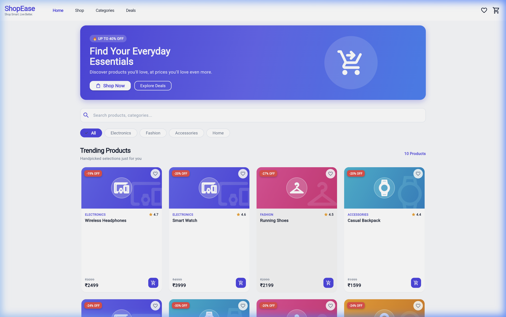
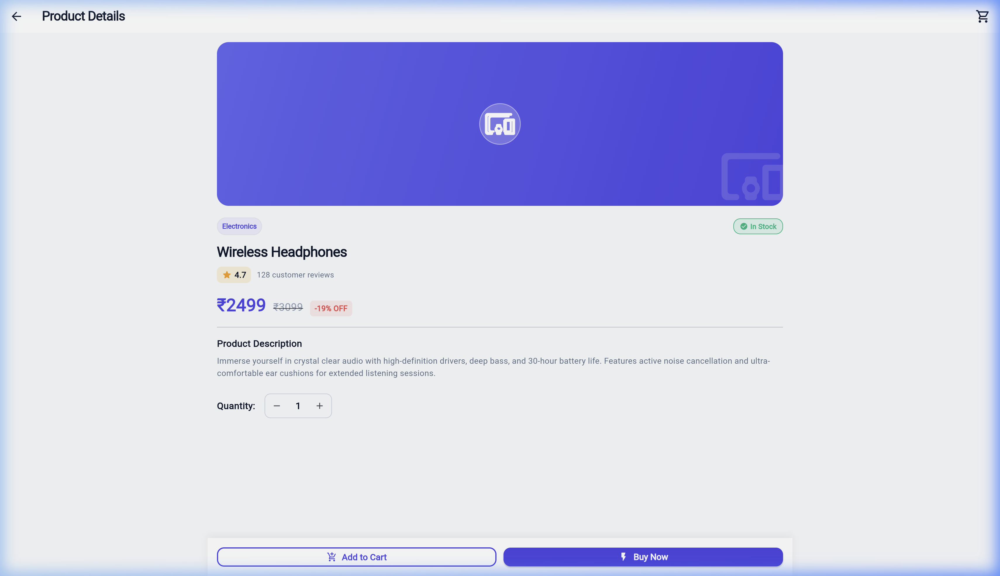
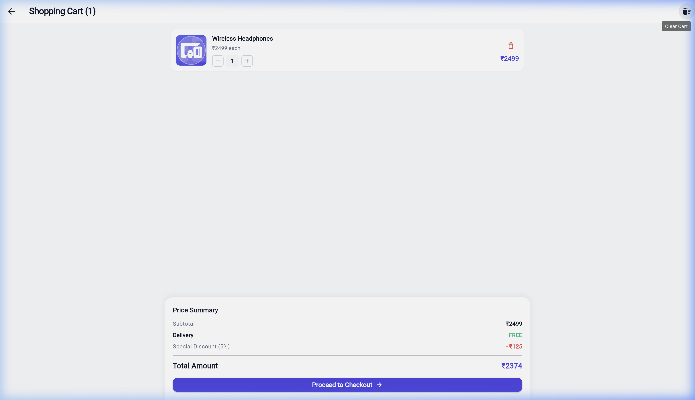
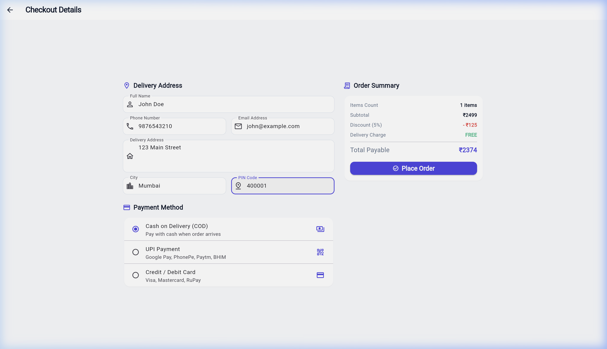
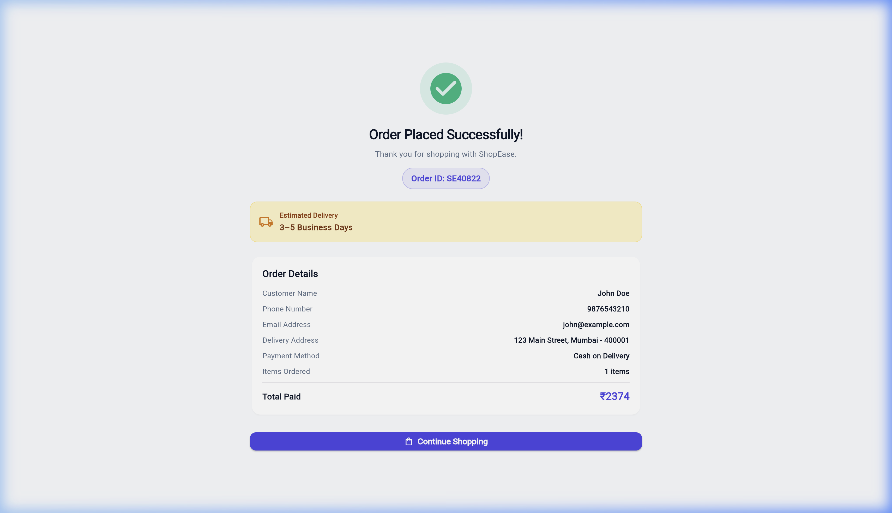

# ShopEase — E-Commerce Shopping Cart App 🛍️

> **"Shop Smart. Live Better."**

A modern, functional, realistic, and visually attractive Flutter Web application built for a 20-mark University Flutter Mini Project evaluation. Designed for browser execution in Google Chrome via Flutter Web.

---

## 📌 Overview

**ShopEase** is a complete e-commerce mobile/web shopping application designed with modern Material 3 aesthetics. The app provides a seamless online shopping experience with product search, category filtering, product details, dynamic cart management, interactive checkout form validation, and an order confirmation receipt.

---

## 🎯 Objective

- Demonstrate standard Flutter Material UI components and clean layouts.
- Implement pure Flutter state management (`ChangeNotifier` & `InheritedNotifier`) without 3rd-party dependencies.
- Build interactive user input forms with strict regex validation (`GlobalKey<FormState>`).
- Implement dynamic cart calculations (subtotal, 5% promotional discount, free delivery, total price).
- Support responsive browser layouts across desktop, tablet, and mobile screens using `LayoutBuilder` & `ConstrainedBox`.

---

## ✨ Features

1. **Top Navigation & Hero Banner**:
   - Branded desktop app bar with links (*Home*, *Shop*, *Categories*, *Deals*).
   - Promotional Hero section featuring `"UP TO 40% OFF"`, main headline, call-to-action buttons, and hero graphics.
2. **Product Catalog & Filtering**:
   - 10 realistic products across Electronics, Fashion, Accessories, and Home categories.
   - Real-time product search bar.
   - Horizontally scrollable category filter chips (`All`, `Electronics`, `Fashion`, `Accessories`, `Home`).
   - Interactive favorite heart toggle on product cards.
   - Discount badges (e.g. `-20% OFF`) and strikethrough original pricing (~~₹3,099~~).
3. **Product Details Screen**:
   - Category tags, star rating with customer review counts, and stock status badge (`✓ In Stock`).
   - Quantity selector (`- 1 +`) with lower-bound safety.
   - Quick **Add to Cart** (with feedback `SnackBar`) and direct **Buy Now** buttons.
4. **Shopping Cart Management**:
   - Floating cart badge displaying real-time total item count.
   - Inline quantity increase/decrease buttons and item deletion.
   - Dynamic price breakdown (Subtotal, 5% Discount, Free Shipping, Total).
   - Styled **Empty Cart** fallback UI with "Continue Shopping" CTA.
5. **Two-Column Checkout Form & Validation**:
   - Two-column responsive desktop layout (Delivery Form & Payment Options on left, Order Summary on right).
   - Customer details input: Full Name, 10-digit Phone, Email, Delivery Address, City, 6-digit PIN Code.
   - Input validation using regex matching and custom error messages.
   - Payment selection via Radio options (Cash on Delivery, UPI, Credit/Debit Card).
6. **Order Confirmation & Receipt**:
   - Success checkmark banner and unique generated Order ID (`SE10245`).
   - Order recap displaying customer information, items summary, and payment method.
   - Estimated delivery timeline banner (3–5 Business Days).
   - "Continue Shopping" button that resets cart state and clears history stack.
7. **Commercial Footer**:
   - Multi-column footer covering Shop, Support, About links, and copyright statement.

---

## 📱 Application Flow

```text
Home
  ↓
Product Details
  ↓
Add to Cart
  ↓
Cart
  ↓
Checkout
  ↓
Order Confirmation
  ↓
Home (Cart Reset)
```

---

## 🖼️ Screenshots

### Home Screen


### Product Details


### Cart


### Checkout


### Order Confirmation


---

## 🛠️ Flutter Widgets Used

- **Layout & Structure**: `Scaffold`, `AppBar`, `SafeArea`, `Container`, `Column`, `Row`, `Stack`, `ConstrainedBox`, `LayoutBuilder`, `SingleChildScrollView`, `CustomScrollView`, `SliverGrid`, `SliverToBoxAdapter`
- **Data & Displays**: `Card`, `ListView`, `GridView`, `Text`, `Image`, `Icon`, `Chip`, `ChoiceChip`, `Badge`, `CircleAvatar`, `Divider`
- **User Inputs & Buttons**: `TextField`, `TextFormField`, `Form`, `GlobalKey`, `ElevatedButton`, `OutlinedButton`, `TextButton`, `IconButton`, `RadioListTile`, `InkWell`
- **Feedback & Interactions**: `SnackBar`, `AlertDialog`, `Dialog`

---

## ⚙️ Technologies Used

- **Framework**: Flutter (v3.44.8)
- **Language**: Dart (v3.12.2)
- **Design System**: Material 3 (`useMaterial3: true`)
- **Target Platform**: Web (Google Chrome) / Cross-platform
- **State Management**: Standard Flutter `ChangeNotifier` & `InheritedNotifier` (Zero external packages)

---

## 📂 Project Structure

```text
shopease/
│
├── lib/
│   ├── main.dart                   # Entry point & Material 3 App initialization
│   ├── data/
│   │   └── product_data.dart       # Hardcoded dataset (10 products with oldPrices & discounts)
│   ├── models/
│   │   ├── product.dart            # Product data model with discountPercent getter
│   │   ├── cart_item.dart          # Cart item data model
│   │   └── order_model.dart        # Order model
│   ├── providers/
│   │   └── cart_provider.dart      # Pure Flutter Cart state controller & InheritedNotifier
│   ├── screens/
│   │   ├── home_screen.dart        # Hero banner, Search, Category chips, Product grid, Footer
│   │   ├── product_details_screen.dart # Details, discounts, stock & quantity selector
│   │   ├── cart_screen.dart        # Cart list & price breakdown summary
│   │   ├── checkout_screen.dart    # Two-column desktop checkout form & validation
│   │   └── order_confirmation_screen.dart # Success receipt & delivery summary
│   ├── utils/
│   │   └── app_theme.dart          # Indigo & Slate Material 3 Theme system
│   └── widgets/
│       ├── cart_badge.dart         # Shopping cart icon with dynamic badge count
│       ├── cart_item_card.dart     # Cart item row with quantity modifiers
│       ├── product_card.dart       # Responsive product card with discount badges
│       ├── product_image_view.dart # Custom image component with category fallbacks
│       └── responsive_container.dart # Container limiting max width (1200px)
├── assets/
│   └── images/                     # Local product image assets
├── test/
│   └── widget_test.dart            # Flutter widget test suite
├── pubspec.yaml                    # Dependencies & assets configuration
└── README.md                       # Master project documentation
```

---

## 🚀 How to Run

### Prerequisites

- Flutter SDK installed & added to PATH.
- Google Chrome browser installed.

### Step 1: Clone or Navigate to Project

```bash
cd ShopEase
```

### Step 2: Fetch Dependencies

```bash
flutter pub get
```

### Step 3: Run in Web Browser

To launch the project in Google Chrome:

```bash
flutter run -d chrome
```

---

## 🔮 Future Scope

- Integration with REST APIs and Node.js/Firebase backend.
- User authentication and profile management.
- Real payment gateway integration (Razorpay / Stripe).
- Persistent cart storage using local storage / Hive.
- Order history tracking page.

---

## 👨‍💻 Developer / Team

- **Project**: University 20-Mark Flutter Mini Project
- **Course**: Mobile Application Development (Flutter)
- **App Name**: ShopEase – E-Commerce Shopping Cart App
